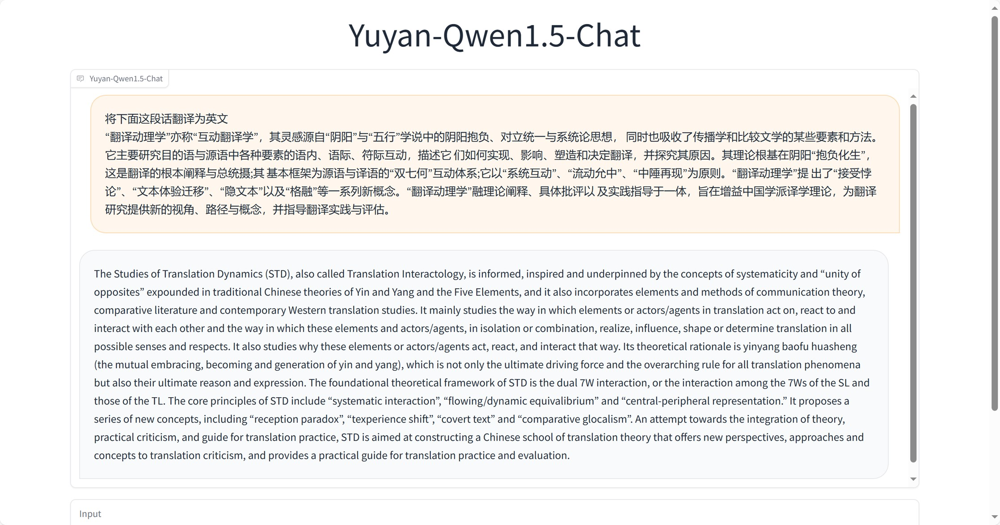
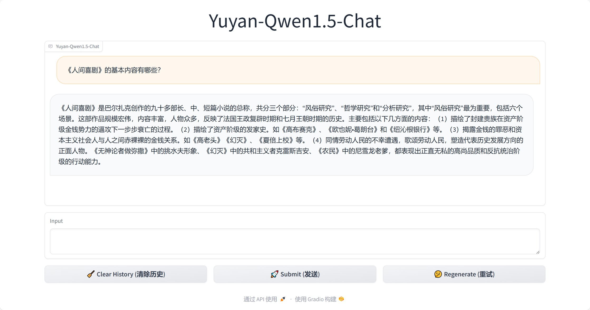
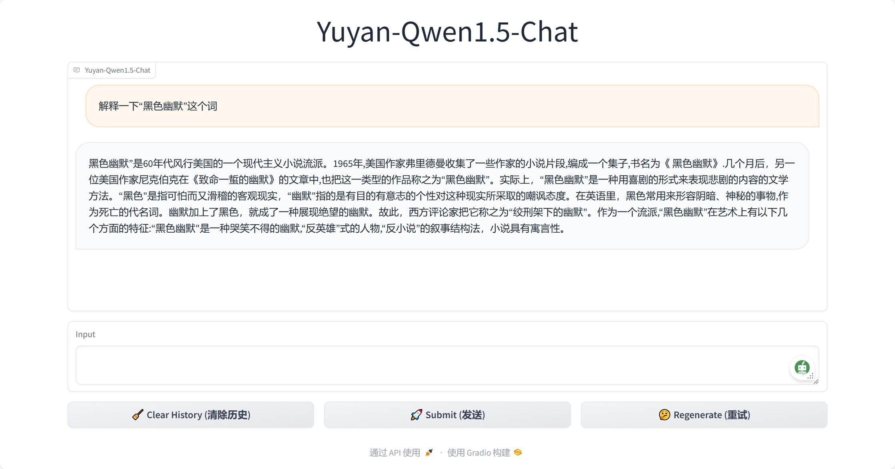

# 语言文学领域大语言模型
## 数据基础
基于语言学、文学领域专业期刊、图书、专著数据，构建了庞大的中英双语语言文学语料库，数据基本情况如下表所示。
|基本信息|数据统计信息（中文）|数据统计信息（英文）|
|-|-|-|
|文本条数|3,582,237条(约358万条)|2,254,309条(约225万条)|
|文本总字（词）数|1,779,021,987(约17亿字)|1,092,916,738(约10亿词)|
|去重总字（词）数|27,559|48,767|

## 模型基础
构建了面向语言文学领域大语言模型评价体系，详见([面向语言文学领域的大语言模型性能评测研究](http://www.wydhjx.cbpt.cnki.net/WKG/WebPublication/paperDigest.aspx?paperID=8aaf84c8-544d-43b6-8bf6-7c7974369d64))，针对语言文学领域特性，划分了五个子任务对当前通用大语言模型进行评价，选取了性能较为优越的Qwen1.5模型作为增量预训练的基础模型。

## 模型训练
### 基座模型训练
基座模型是开展垂直领域应用的基础，基于本研究构建的数据集以及选取的开源大模型，构建了面向语言文学领域学术文本的基座模型，相较于通用领域模型，该模型学习了更多领域知识，能够为语言文学领域化任务提供更加优越的微调基础，便于结合语言文学特色进行领域化任务微调。
### 对话模型训练
为便于更多非计算机专业人士使用模型，结合前期构建的领域化预训练数据集，通过机器辅助、人工校对的方式构建了一批语言文学领域指令数据，在基座模型的基础上进行了指令微调，构建了语言文学领域对话模型。
## 效果展示
* 领域文本翻译

* 领域知识问答

* 领域术语解释


## 项目联系人
```
北京外国语大学-孙凤兰老师
地址：北京市海淀区西三环北路19号北楼2309室
邮箱：sunfl@bfsu.edu.cn
```